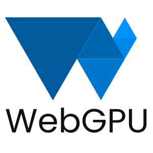

[WebGPU](https://www.w3.org/TR/webgpu/) 做为下一代 Web 图形API接口，正在逐步地被各大浏览器实现。相较于它的前辈 WebGL 及其 WebGL2，WebGPU 基于现代图形API设计，少了很多束缚，能更好地释放现代GPU的性能与特性，比如原生支持计算管线（Compute Pipeline）及其计划中对光线追踪的支持。至于为什么不继续推出 WebGL3 而是开发一个全新的API，可以在[这里](https://gpuweb.github.io/gpuweb/explainer/)找到更详细的解释。

这个系列的文章记录于笔者从零开始的学习过程，希望能给同样对在浏览器上实现 3D 渲染感兴趣的同学有所启发和帮助，同时欢迎[留言讨论](https://github.com/treelite/webgpu-101/issues) :)

## 目前计划中的内容

* [Hello WebGPU](./chapter-0.md)，搭建开发环境并实现第一个 WebGPU 程序
* [2D绘图](./chapter-1.md)，在 2D 坐标系下进行绘图，涉及渲染管线、顶点着色器、片原着色器
* [基本动画](./chapter-2.md)，涉及矩阵变化及缓冲区数据交换
* 3D绘图，在 3D 坐标系下进行绘图，涉及矩阵顶点索引及其深度检测
* 纹理贴图
* 光线
* 阴影
* 粒子效果
* 导入 3D 模型
* ...
