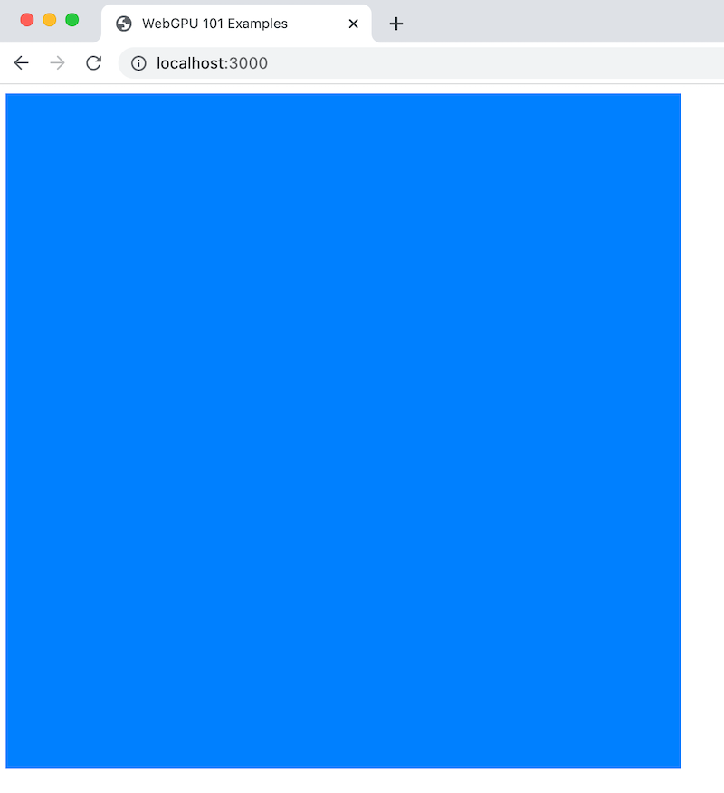

目前 WebGPU 还处于技术体验阶段，[未被浏览器正式启用](https://caniuse.com/?search=webgpu)，我们还需要一些额外的设置来开启它。本篇主要围绕开发环境的搭建及其我们的第一个 WebGPU 示例来展开。

## 开启 WebGPU

浏览器启用 WebGPU 的方式各有不同，这里主要以最新版的 Chrome 为例。具体而言，Chrome 提供了两种不同纬度的方式来开启 WebGPU:

**本地 WebGPU feature flag**

通过访问 `chrome://flags`，搜索 `webgpu` 可以手动开启或者禁用 WebGPU 特性。

**Chrome Origin Trial**

Chrome 的技术体验计划，通过申请一个 Trial Token 并将其做为 meta 信息嵌入 HTML 中就能让这个页面默认启动对应的特性。WebGPU 的体验会持续到109版并计划于明年2月1日终止，在那之前都可通过[这里](https://developer.chrome.com/origintrials/#/view_trial/118219490218475521)来申请Token。之后只需要在页面中添加如下的 meta 标签即可：
```html
<meta http-equiv="origin-trial" content="TRIAL_TOKEN">
```

目前更推荐使用 Origin Trial 来开启 WebGPU，能限制浏览器新特性的应用范围总是更好的，而且 Origin Trial 支持申请 `localhost` 域名，完全可以用于本地的开发调试。

## 开发环境

其实开发环境没有什么特别的，按照个人喜好来搭建就好。只是有一点想特别推荐一下，那就是官方的 [TypeScript 类型定义](https://github.com/gpuweb/types)，对于了解各API的定义与参数含义特别有帮助，与 [WebGPU 规范](https://www.w3.org/TR/webgpu/)搭配使用效果最佳。

所有用到的示例都可以在[这里](https://github.com/treelite/webgpu)找到对应的源码。为了方便，这里也简单介绍下示例用到的开发工具：

**Vite**

[Vite](https://vitejs.dev/) 新一代的前端本地开发环境，最大的优势就是原生支持 ES module 规范。对于我们的示例程序不需要额外的任何配置，简单、方便、快捷。

**TypeScript**

主要就是为了前面提到的官方类型定义，不过没有接触过的同学也不用担心，示例还是集中于 WebGPU API 本身，并不会包含过多的 TypeScript 独有特性，整体阅读起来应该与 JavaScript 的区别不大。

**第三方依赖**

为了更好的巩固和展现所有的技术点，希望所有的示例都不直接使用第三方依赖，全部从零开始实践。当然期间也会参考现有工具、框架的实现，但更期待是借鉴而非直接使用，以求能最大程度理解并解释实现的细节。

## 开始第一个 WebGPU 示例

GPU 编程有别于 CPU 编程的一大特点是需要经历从 CPU 到GPU 的转移，其中涉及程序与数据从内存到显存的转移，也涉及 CPU 到 GPU 的运行环境切换，体现到 API 层面就是异步操作。虽然并不是每一个 API 接口都返回 Promise，但是在底层实现上都是异步进行的。因此总体而言，对于 GPU 的编程可以简单概括为：
* 按顺序设置一系列需要 GPU 进行的操作
* 将这些操作提交到 GPU 执行
* 接收操作的结果
    * 呈现在显示设备上
    * 或者将计算结果拷贝回内存

另外由于这种特殊的异步性质，WebGPU 的错误处理机制也有别于普通的脚本程序，后续会单独讨论。

接下来我们就开始实现我们的第一个 WebGPU 示例：渲染一个蓝色的画布。

### WebGPU 初始化

WebGPU 的入口就是这个位于 `navigator` 上的 `gpu` 对象，我们可以通过检测此对象来确定浏览器是否支持 WebGPU：
```ts
if (!navigator.gpu) {
  throw new Error("please enable WebGPU");
}
```

目前 `gpu` 对象十分简单，只包含了两个方法：
```ts
interface GPU {
  requestAdapter: (options?: GPURequestAdapterOptions) => Promise<GPUAdapter?>;
  getPreferredCanvasFormat: () => GPUTextureFormat;
}
```

**requestAdapter** 用于获取一个 GPU 的适配器对象 `GPUAdapter`，通过该适配器我们可以获取到最重要的 `GPUDevice` 对象。它是 GPU 的一个逻辑抽象，后续所有的操作都基于它的。我们还可以通过 `GPURequestAdapterOptions` 参数来设置适配器的类型，低功耗或者高性能，默认情况下由浏览器视当前系统硬件条件及运行情况（比如电量）来选择合适的适配器，大多数情况下默认的适配器就足够了。

**getPreferredCanvasFormat** 用于返回当前 Canvas 对象支持的渲染格式。由于操作系统的不同，Canvas 支持的渲染格式会有所不同，我们后续进行图形渲染时会用到它。

```ts
const presentFormat = navigator.gpu.getPreferredCanvasFormat();
const adapter = await navigator.gpu.requestAdapter();
if (!adapter) {
  throw new Error("failed to get adapter");
}
```

`GPUAdapter` 对象中的 `requestDevice` 方法可以用来获取 `GPUDevice` 对象
```ts
interface GPUAdapter {
  ...
  requestDevice: (descriptor: GPUDeviceDescriptor = {}) => Promise<GPUDevice>;
  ...
}
```
可选的 `descriptor` 参数用于指定 `GPUDevice` 对象需要满足的特性或者限制，这部分取决于具体的硬件设备，如果没法满足要求的的话，返回的 `GPUDevice` 对象会标记为不可用（invalid）。大多数情况下可以忽略此参数。
```ts
const device  = await adapter.requestDevice();
```

由于 WebGPU 并不只适用于图形渲染，所以它不直接与 Canvas 关联，而只是将 Canvas 做为图形渲染的一个输出目标，这也是为什么 WebGPU 的 API 并非像 WebGL 那样来源于 `canvas.getContext`。不过为了将 WebGPU 渲染的结果呈现在 Canvas 中，我们还是需要用到 `canvas.getContext` 来对渲染目标进行一番设置：
```ts
const canvas = document.querySelector("canvas");
const ctx = canvas.getContext("webgpu");
ctx.configure({
  device,
  format: presentFormat,
});
```
这里我们将之前创建的 `GPUDevice` 对象绑定到 Canvas 并设置了当前系统支持的渲染格式。

### 开始图形渲染

在完成上述的初始化工作后我们就可以开始要求 GPU 进行工作了。就像之前提到的，我们需要将具体的操作打包发送给 GPU，WebGPU 是通过 `GPUQueue` 对象的 `submit` 方法来提交相应的指令缓冲对象 `GPUCommandBuffer` 来实现的。`GPUCommandBuffer` 中包含了一系列的 GPU 指令，不过直接操作这个缓冲对象比较麻烦，WebGPU 提供了一个指令编码器 `GPUCommandEncoder` 来帮助生成实际的 `GPUCommandBuffer`:
```ts
// 创建指令编码器
const cmdEncoder = device.createCommandEncoder();
// 往 cmdEncoder 中添加相应的 GPU 操作
...
// 调用 `finish` 方法来结束编码并生成对应的 `GPUCommandBuffer`
const cmdBuffer = cmdEncoder.finish();
// 将指令提交给 GPU 执行
device.queue.submit([cmdBuffer]);
```
可以看到 `submit` 方法接收的是一个 `GPUCommandBuffer` 的数组，也就是说一次可以提交多个 `GPUCommandBuffer`，而 GPU 会按照顺序执行它们。另外需要注意的是每次调用 `submit` 方法后，所提交的 `GPUCommandBuffer` 就不再可用了，也就说每次的渲染我们都需要创建新的 `GPUCommandBuffer`。

现代 GPU 除了可以完成图像渲染外，还可以进行大量的并行计算操作，比如深度学习，因此 `GPUCommandEncoder` 可支持的指令就主要分为了两大类：
* 计算指令
* 渲染指令

分别由以下两个编码器提供支持：
* `GPUComputePassEncoder` 用于编码计算指令
* `GPURenderPassEncoder` 用于编码渲染指令

我们前期的示例都是有关于图形渲染的，因此会主要用到 `GPURenderPassEncoder`，后期讨论计算指令的时候我们再来关注 `GPUComputePassEncoder`。


`GPURenderPassEncoder` 是由 `GPUCommandEncoder` 的 `beginRenderPass` 方法创建的：
```ts
interface GPUCommandEncoder {
  ...
  beginRenderPass: (descriptor: GPURenderPassDescriptor) => GPURenderPassEncoder;
  // 相应的也有创建 GPUComputePassEncoder 的方法:
  beginComputePass: (descriptor: GPUComputePassDescriptor = {}) => GPUComputePassEncoder;
  ...
}
```
必选参数 `descriptor` 用于设置 `GPURenderPassEncoder` 的初始状态，而其中最重要也是必需设置的是 `colorAttachments` 属性，用于设置最终渲染结果需要输出到哪里，在本示例中也就是指我们之前创建的 Canvas 对象。通过属性名还可以看出输出目标可以是多个，也就说如果有必要，我们可以同时将渲染结果输出到多个 Canvas 中。不过 `colorAttachments` 属性并不直接接收 Canvas 对象，而是需要我们通过设置 `GPURenderPassColorAttachment` 对象来描述输出目标，比如这样：
```ts
const renderPassEncoder = cmdEncoder.beginRenderPass({
  colorAttachments: [
    // GPURenderPassColorAttachment 对象
    {
      // 这里的 ctx 是之前通过 `canvas.getContext("webgpu")` 得到的
      view: ctx.getCurrentTexture().createView(),
      loadOp: "clear",
      storeOp: "store",
      clearValue: { r: 0.0, g: 0.5, b: 1.0, a: 1.0 },
    },
  ],
});
```
其中的 `view`, `loadOp` 和 `storeOp` 属性都是必选的。`view` 属性的类型是 `GPUTextureView`，表示一个纹理的视图对象，它实际就是渲染结果最终输出的地方。为了渲染到 Canvas 上，我们通过 `ctx` 的 `getCurrentTexture` 方法获取到 Canvas 元素当前的纹理对象，然后在它之上调用 `createView` 创建一个纹理视图对象并将其赋予 `GPURenderPassColorAttachment` 对象的 `view` 属性完成绑定。`loadOp` 表示在渲染开始之前对纹理视图对象进行何种加载操作，可选的值分别是两个字符串常量：

* `"load"`: 表示加载纹理视图对象已有的数据，相当于在已有的画布基础上继续渲染
* `"clear"`: 表示清除纹理视图对象已有的数据，相当于先清空画布

如果 `loadOp` 设置为 `"clear"` 的话，我们还需要指定 `clearValue`，选择一种颜色来清除纹理视图对象，也就是给画布上一个底色。示例中使用了一个 `rgba` 颜色，蓝色偏绿。最后一个必选参数是 `storeOp`，表示如何处理渲染结构，其值也是两个字符串常量：

* `"store"`: 表示保留渲染结果
* `"discard"`: 放弃渲染结果

很显然，我们需要将渲染结果显示在 Canvas 上，我们这里就将 `storeOp` 设置为 `"store"`。

下一步我们一般就会开始具体的渲染操作，比如画一个三角形，不过那是我们下一回需要讨论的东西。目前我们不妨直接结束渲染，看看我们已有的成果：
```ts
// 结束渲染指令编码
renderPassEncoder.end();
// 结束指令编码器并生成 `GPUCommandBuffer`
const cmdBuffer = cmdEncoder.finish();
// 提交指令给 GPU 执行
device.queue.submit([cmdBuffer]);
```

如果一切顺利，我们应该会看到如下的渲染结果：



也就是说我们已经通过直接操作 GPU 来给页面画上了一个不算太难看的蓝色方块，恭喜！我们已经完成了[第一个可运行的 WebGPU 程序](https://github.com/treelite/webgpu-101/blob/master/examples/src/chapter-0.ts)。

## 总结

虽然到目前为止我们还没有在页面上渲染任何实质的内容，但是一个 WebGPU 程序的大致渲染流程依然成型，基本就是：
* 创建 `GPUAdapter`
* 创建 `GPUDevice`
* 设置 `canvas`
* 正确设置 `GPUCommandBuffer`
* 提交 `GPUCommandBuffer` 给 GPU 执行

后续所有更复杂的示例都将围绕如何正确设置对应的 `GPUCommandBuffer` 而展开。
