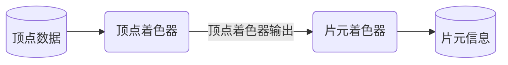

GPU 最重要的工作就是绘图，在 WebGPU 中这部分主要由渲染管线（GPURenderPipeline）相关的API 来完成，这一节我们就将使用它来绘制一个二维彩色三角形。不过在开始实际探索前，我们先来简单了解下 GPU 是如何将一个图像呈现在显示设备上的。

## 绘图原理

从本质上讲，GPU 是通过精确控制显示设备上每一个像素的颜色来呈现一个图像的。从开发者的角度来看，直接操作所有的像素点来绘图是相当繁琐的，更别提分辨率的改变基本也就意味着代码的重写。

如果我们抛开像素观察图形本身，比如说一个三角形，不管是在哪种分辨率下，一个三角形总是由三个点连接而成，如果能确定三个顶点的坐标，我们也就确定的一个三角形。更进一步，我们可以通过点来确定线，线构成面，一步一步完成图像的绘制。这里也就引出了图形渲染中一个基本概念：顶点（vertex）。我们只需要确定图形所有顶点的坐标，就能通过连接它们来完成图形构建。

不过图形构建并不等同于图形渲染，虽然我们已经有了一个完整的图形，但我们仍然还不知道每个具体的像素点应该是什么颜色，因此我们需要一个特殊的处理来完成图形到像素点的映射，也就是光栅化。GPU 会将顶点所处的坐标系映射到输出平面上，以此来确定像素点与顶点的关系，进而确定每一个像素点的颜色。

总的来说，图形渲染中的两大关键步骤就是：
1. 通过顶点来完整图形的构建
2. 通过光栅化将图形经由像素呈现

仔细的你可以会想到我们好像漏了什么，顶点的坐标确定了图形的形状，但是颜色信息又从何而来呢？实际上顶点信息中不光可以有坐标信息，还可以包含颜色信息。比如说三角形三个顶点都是红色，那么最终的三角形就是红色。那这样又会有一个有趣的问题，如果三个顶点的颜色各不相同会怎样呢？答案就是你会得到一个渐变的三角形！比如这样：

这是由于 GPU 在进行光栅化的过程中，为了确定非顶点点的数据而进行了插值计算。就比如点的坐标会平滑的从一个顶点过渡到另外一个顶点一样，颜色信息也会从一个顶点过渡到另外一个顶点，从而产生了颜色渐变的效果。

## 顶点数据

WebGPU 中的坐标系并不像页面坐标系那样将原点定义为页面左上角，WebGPU 的原点是在画布的中心点。x轴从左向右延伸，最小值为-1，最大值为1。相应的y轴从下往上，z轴从里向外，而取值都是-1到1。绘制二维图形的时候我们通常都将z轴设置为0，那么本次的三角形顶点的坐标如下：
```typescript
const vertices = new Float32Array([
  // 顶部
  0, 0.5, 0,
  // 左下角
  -0.5, -0.5, 0,
  // 右下角
  0.5, -0.5, 0,
]);
```

需要特别注意的是由于 WebGPU 中顶点数据是 `flat32` 类型，因此我们在定义顶点时得使用类型数组`Float32Array`。另外如果再加上顶点颜色信息的话，顶点数据就会长这样：
```typescript
const vertices = new Float32Array([
  // top, red
  0, 0.5, 0, 1, 0, 0, 1,
  // left, green
  -0.5, -0.5, 0, 0, 1, 0, 1,
  // right, blue
  0.5, -0.5, 0, 0, 0, 1, 1,
]);
```

颜色使用 rgba 形式定义，同样是用 `flat32` 类型，取值范围是0 ~ 1。这里我们设置顶部为红色(1, 0, 0, 1), 左下角为绿色(0, 1, 0, 1)，右下角为蓝色(0, 0, 1, 1)。

## 顶点着色器与片元着色器

之前提到过，图形渲染中有两大关键步骤：通过顶点来构建图形以及通过光栅化来显示图形。为了更好的控制和自定义这两个步骤，GPU 提供了一种可编程的方式来进行操作，也就是着色器(shader)，一种使用特定的着色器语言(shader language)进行编写、并最终由 GPU 执行的程序。着色器的主要工作就是告诉 GPU 该如何处理数据、执行渲染，按照执行阶段的不同可以简单分为：
* 顶点着色器：处理顶点数据，确定顶点的坐标与颜色等数据，主要负责构建图形
* 片元着色器：运行在光栅化过程中，用于确定每一个片元(fragment)的颜色等信息。片元就是用于生成最终像素的信息，包括但不仅限于颜色，同时一个像素点可能需要多个片元配合来生成。

通常情况下，顶点着色器的输入是顶点数据，输出会成为片元着色器的输入，而片元着色器的输出就是最终的片元信息（颜色等）。


WebGPU 使用的着色器语言是 [WGSL](https://www.w3.org/TR/WGSL)，类似于带装饰器的 Rust 语言，比如说我们这次绘制三角形需要用到顶点着色器：
```rust
// 定义一个数据结构
struct Result {
  // 将 "position" 属性绑定到内建的 position 值，用于指定顶点位置
  @builtin(position) position: vec4<f32>,
  // 将 "color" 属性做为顶点着色器第一输出位置的数据
  @location(0) color: vec4<f32>,
}

// 声明此函数是顶点着色器的入口函数
@vertex
/**
 * 定义了两个输入参数
 * position {vec3<f32>} float32 的三维向量(x, y, z)
 * color {vec4<f32>} float32 的四维向量(r, g, b, a)
 *
 * 同时返回参数是之前定义的 Result 结构
 */
fn main (@location(0) position: vec3<f32>, @location(1) color: vec4<f32>) -> Result {
  var res: Result;
  // 将输入参数赋值给 position 属性，也就是在设置内建的 position 值，即顶点坐标
  // 输入参数是三维向量，而内建的 position 值是四维向量，所以这里进行了一下简单的数据转化
  // 使用 “1.0” 来填充缺失的第四维数值
  res.position = vec4(position, 1.0);
  // 直接输出输入的颜色信息
  res.color = color;
  return res;
}
```

顶点着色器会将每一个顶点做为一次输入，执行后确定该顶点的最终坐标等信息。我们这个示例很简单，直接将输入的顶点信息输出。关键点在于 `@builtin(position)` ，它指定了如何将坐标信息绑定到内建的 "position" 属性，也就是顶点的最终坐标。后续我们会在顶点着色器中看到更多、更复杂的顶点操作，比如将顶点进行旋转、移动等。

那我们接着来看这次会使用到的片元着色器：
```rust
// 声明此函数是片元着色器的入口函数
@fragment
/**
 * 定义了一个绑定到第一输入位置的参数
 * color {vec4<f32>} float32 的四维向量(r, g, b, a)
 *
 * 返回一个四维向量并将其做为片原作色器的第一输出位置的数据
 */
fn main(@location(0) color: vec4<f32>) -> @location(0) vec4<f32> {
  return color;
}
```

它也很简单，没有任何额外的操作，同样是直接将输入的颜色做为输出。唯一需要关注的地方是顶点着色器的输出是如何关联被到片元着色器的输入上。注意代码中的 `@location` 装饰器，它用于指定输入数据的获取位置或者输出数据的存放位置。在顶点着色器中，我们将 `@location(0)` 设置到了结构体 `Result` 中的 `color` 属性上，也就是说顶点的颜色 `color` 会被存在0号位置上。而在片元着色器中，我们的输入参数 `color` 也使用了 `@location(0)`，也就这个值会从0号位置上获取，这样也就实现了从顶点着色器到片元着色器的数据传输。最后片元着色器再将处理后的颜色存在0号位置以供后续渲染操作使用。

### 编译着色器

## 绑定顶点数据与着色器

## 渲染管线
