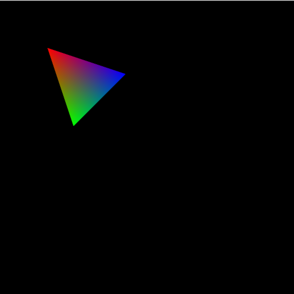

动画本质上就快速地切换不同的画面。比如要实现一个围绕着Z轴不停旋转的三角形，我们实际就是让 GPU 不断地渲染同一个三角形，只是每次的旋转角度有所不同。另外为了让动画看起来更自然、没有卡顿的感觉，我们至少需要一秒渲染24张稍有不同的画面，也就是所谓的每秒24帧。越高的帧率能带来更流畅的动画效果，同时也对 GPU  有更高的运算压力。这次我们就试着让之前那个彩色的三角形动起来。

## 基础坐标变换

动画的基础是让元素产生变化，最直接的就是让元素动起来，也就是坐标的变换。例如最简单的坐标变化就是让三角形从一个位置移动到另外一个位置。

### 位移

由于我们是按照三角形三个顶点来进行绘制，那么我们需要做的也就是在每次绘制时移动一下三个顶点的位置，假设三角形其中一个顶点的位置是`(x, y, 0)`，那么如果我们想将这个三角形向左移动 0.2 的距离，新的顶点坐标就变成了 `(x - 0.2, y + 0, 0)`。为了方便计算我们可以将这个位移定义为一个三维向量，那么向任意方向移动任意距离的位移就可以写作 `(dx, dy, dz)`，而相应的新顶点的坐标就变成了`(x + dx, y + dy, z + dz)`，而这其实就是向量的加法，在顶点着色器中我们可以直接这样写：
```rust
// movement 是一个表示位移的三维向量
// vec3(dx, dy, dz)
newPosition = vec4(position, 1.0) + vec4(movement, 1.0);
```

### 缩放

缩放与位移类似，也是分别作用于每一个坐标轴上，比如我们想将三角形宽度减少50%的同时高度增加20%，那么新顶点的坐标就变成了`(0.5 * x, 1.2 * y, 0)`。同样我们也可以将缩放因子看成一个三维向量`(sx, sy, sz)`，那么在顶点着色器中我们可以这样完成缩放操作：
```rust
// scale 是一个表示缩放因子的三维向量
// vec3(sx, sy, sz)
newPosition = vec4(position, 1.0) * vec4(scale, 1.0);
```

### 旋转

旋转是基本坐标变换中较为复杂的一个，需要涉及到三角函数的应用，我们可以先来关注一个较为简单的场景，绕Z轴旋转，也就是说我们只需要对x, y 轴进行变化。假设我们想将三角形绕Z轴向逆时针方向旋转α，那么根据三角函数我们可以得到（具体的推导请参考数学书）：
```
x' = x * cosα - y * sinα
y' = x * sinα + y * cosα
```
如果我们将α做为参数传入顶点着色器的话，我们就可以像这样来完成Z轴旋转操作：
```rust
// angle 是传入参数α
newPosition = vec4(
  position.x * cos(angle) - position.y * sin(angle),
  position.x * sin(angle) + position.y * cos(angle),
  position.z,
  1.0,
);
```

### 组合坐标变换

位移、缩放与旋转就是我们常用的三种坐标变换。根据其定义，每种变换的计算方式都不相同。诚然我们可以在顶点着色器中定义三个子函数来分别完成这些转换，但在复杂的组合变换下可能会由于过多的输入参数导致整个变换过程变得很繁琐。好在我们还有另外一个数学工具可以让我们将这三种变换统一起来：矩阵（Matrix）。根据定义，矩阵**右乘**一个向量会得到一个新的向量`maxtrix * vector1 = vector2`，所以我们可以通过一个矩阵来对向量进行变换。为了方便，我们可以将这个矩阵称之为变换矩阵，比如说表示缩放的变换矩阵`m1`可以写成：
```typescript
[
  sx, 0, 0,
  0, sy, 0,
  0, 0, sz
]
```
对于一个顶点坐标向量`v1(x, y, z)`，`m1 * v1` 就等于
```typescript
(
  sx * x + 0 * y + 0 * z,
  0 * x + sy * y + 0 * z,
  0 * x + 0 * y + sz * z,
)
```
正好也就是缩放操作的原始定义`(sx * x, sy * y, sz * z)`。相应的，旋转矩阵可以写成：
```typescript
[
  cos(α), -sin(α), 0,
  sin(α), cos(α), 0,
  0, 0, 1,
]
```
位移矩阵相较另外两个矩阵稍有不同。因为位移的基本操作是在原有坐标上加（或者减）一个值，这个操作无法在三维矩阵中完成，所以我们将变换矩阵扩展到四维，这样我们就可以用多出来的那一维来表示对前三维数据的修正：
```typescript
[
  1, 0, 0, dx,
  0, 1, 0, dy,
  0, 0, 1, dz,
  0, 0, 0, 1,
]
```
相应的，我们的顶点坐标也会扩展到四维，这也是为什么 `WGSL` 中内建的`position`变量是`vec4`类型而不是`vec3`类型的原因。

将变换使用矩阵来表示后，我们还会得到另外一个便利：组合变换。比如说我们想要将三角形先旋转一下(m1)，然后进行缩放(m2)，最后再移动下位置(m3)，那么最终顶点的坐标位置应该是:
```rust
newPosition = m3 * m2 * m1 * vec4(position, 1.0);
```
注意这里`m1`、`m2` 及其 `m3` 进行乘法操作时顺序。矩阵右乘向量才能产生新向量，因此首选进行的旋转操作`m1`需要写在最靠近向量的地方，然后才是缩放`m2`，最后才是位移`m3`。其次按照运算的结合律，我们可以先计算所有矩阵的乘积后再与向量进行运算，即`newPosition = (m3 * m2 * m1) * vec4(position, 1.0)`。而且对于每一个顶点而言，这些变换矩阵并不会改变，也就是说与其向顶点着色器传入代表三个不同变换的矩阵，我们可以只传入一个所有变换矩阵的乘积结果。只需要一个矩阵就可以表示所有需要进行的变换，并且这些变换只需要在 CPU 上运算一次而不再需要针对每一个顶点在 GPU 上进行重复计算。另外还有一点需要特别注意一下，矩阵的乘法并不满足交换律，其进行运算的顺序是不可改变的：`m1 * m2 !== m2 * m1`。在几何上，将顶点先旋转再移动和先移动再旋转也是不一样的，这点可以在后续代码中通过修改相应变换矩阵的顺序来实际感受下。

## uniform 变量

在之前的章节中我们通过顶点着色器的输入参数传入顶点坐标及其颜色，我们也可以通过同样的方式传入变换矩阵。但变换矩阵与顶点信息不同的是它并不随顶点而变化，因此也没有必要在顶点数据中反复重复相同的变换矩阵。这里我们真正需要的是 `uniform` 变量，它是着色器的一种输入数据：
```rust
var<uniform> modelViewMatrix: mat4x4<f32>;
```
这里我们声明了一个类型为 `mat4x4<f32>` 的 `uniform` 变量 `modelViewMatrix`，用以表示变换矩阵。`var` 用于声明变量，其后的尖括弧为可选，用于指定变量的地址空间（address space）。`uniform` 只是其中的一种地址空间，我们后续还会见到 `private`, `storage` 等。有了这个变量后，我们就可以在顶点着色器中通过简单的乘法来确定顶点的最终坐标：
```rust
// 沿用上一章的数据结构
// res.position 绑定到了 @builtin(position)
res.position = modelViewMatrix * vec4(position, 1.0);
```

与顶点信息类似，我们需要借助 `GPUBuffer` 来将变换矩阵从内存拷贝到显存中：
```typescript
// Matrix4 是一个简单的4x4矩阵类
// 用于简化矩阵的运算
// 具体实现请参考示例目录下的源代码
const modelViewMatrix = new Matrix4();
// 按照z轴向逆时针旋转45度，然后在x与y轴上缩小50%，最后再向左上角移动
modelViewMatrix.translate(-0.5, 0.5, 0).scale(0.5, 0.5, 1).rotateZ(45);
// 创建一个用于存储 uniform 变量的 GPUBuffer 对象
const modelViewMatrixBuffer = device.createBuffer({
  size: modelViewMatrix.byteLength,
  usage: GPUBufferUsage.UNIFORM | GPUBufferUsage.COPY_DST,
  mappedAtCreation: true,
});
// 拷贝数据
new Float32Array(modelViewMatrixBuffer.getMappedRange()).set(modelViewMatrix.toWebGPUMatrix());
modelViewMatrixBuffer.unmap();
```
`modelViewMatrixBuffer`的创建过程与之前见过的`vertexBuffer`一样，创建的同时就进行映射，以便进行初始化。唯一的不同就是 `usage` 被设置为 `GPUBufferUsage.UNIFORM`，表明这是一个用于存储 `uniform` 数据的缓冲。虽然我们这里不会展开描述 `Matrix4` 类的实现（因为很简单，也没啥可说的）但还是有两点需要关注下。第一点是变换矩阵设置的方式。虽然从方法的调用顺序上看，我们是先移动`translate`，然后缩放`scale`，最后再旋转`rotateZ`。但由于这个变换矩阵只可能右乘顶点向量，因此实际变换应用的顺序与方法调用的顺序相反。第二点是关于 `toWebGPUMatrix` 方法的实现。在 `WGSL` 中，矩阵类型的变量都是以列优先存储的，例如一个位移变换矩阵按列存储应该是：
```typescript
[
  1, 0, 0, 0,
  0, 1, 0, 0,
  0, 0, 1, 0,
  dx, dy, dz, 1,
]
```
因此 `toWebGPUMatrix` 方法不光会将普通的数组转换为 `Float32Array` 而且还将数据按照列优先的方式排列。至于为什么 `WGSL` 会选用列优先来存储矩阵，实际上因为矩阵被看成了嵌套的多维向量，比如四维矩阵其实可以是:
```typescript
vect4(
  vect4(x1, y1, z1, w1),
  vect4(x2, y2, z2, w2),
  vect4(x3, y3, z3, w3),
  vect4(x4, y4, z4, w4),
);
```

## uniform 数据绑定

在有了变换矩阵的数据后我们就应该将这个数据绑定到顶点着色中的 `modelViewMatrix` 变量以待使用。上一章中我们通过在顶点着色器中使用 `@location` 装饰器来确定输入、输出参数的绑定位置。`uniform` 变量也与之类似，我们需要使用到 `@group` 与 `@binding` 装饰器，具体如下：
```rust
@group(0) @binding(0)
var<uniform> modelViewMatrix: mat4x4<f32>;
```
`@group` 用于指定绑定分组（Bind Group）的序号，而 `@binding` 用于指定组内的绑定位置。在进行渲染时我们只需要保证第一个分组中的第一个位置上存储着变换矩阵，顶点着色器就可以正确地获得对应的数据。而为了能将正确的数据填充到这些绑定的分组中，我们还需要通过 `GPUPipelineLayout` 来定义具体的分组格式，以便应用到渲染管线中：
```typescript
// 定义一个只包含一个绑定位置的 `GPUBindGroupLayout` 对象
const bindGroupLayout = device.createBindGroupLayout({
  entries: [{
    binding: 0,
    visibility: GPUShaderStage.VERTEX,
    buffer: {},
  }],
});

const pipelineDesc: GPURenderPipelineDescriptor = {
  // 定义一个只包含一个绑定分组的绑定结构
  layout: device.createPipelineLayout({
    bindGroupLayouts: [bindGroupLayout],
  }),
  ...
};
```
`createBindGroupLayout` 用于定义一个单独的绑定分组，而 `createPipelineLayout` 用于定义所有需要用到的绑定分组。具体而言，我们调用 `createBindGroupLayout` 定义了一个只包含一个绑定位置分组，这唯一的绑定位置只对顶点着色器可见且只用于数据交换（`buffer: {}`）。然后我们调用 `createPipelineLayout` 定义这次的渲染管线中只提供一个分组绑定。这样我们也就完成了 `@group(0) @binding(0)` 的定义。

下一步自然就是将我们之前定义的 `modelViewMatrixBuffer` 绑定到正确的位置上，具体而言我们需要借助 `createBindGroup` 方法来创建一个包含 `modelViewMatrixBuffer` 的 `GPUBindGroup` 对象，然后将其应用到渲染中的第一个绑定分组上：
```typescript
const bindGroup = device.createBindGroup({
  // bindGroupLayout 就是之前由 `createBindGroupLayout` 生成的 `GPUBindGroupLayout` 对象
  layout: bindGroupLayout,
  entries: [
    {
      binding: 0,
      resource: {
        buffer: modelViewMatrixBuffer,
      },
    }
  ]
});

// 将创建的 bindGroup 设置为第一个分组
// passEncoder 就是 GPURenderPassEncoder
passEncoder.setBindGroup(0, bindGroup);
```

至此，如果一切顺利，我们应该就可以得到一个旋转、缩小并且向左上角移动的彩色三角形：


