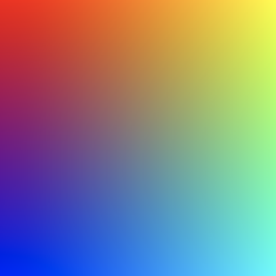
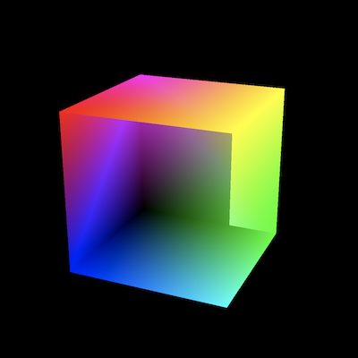
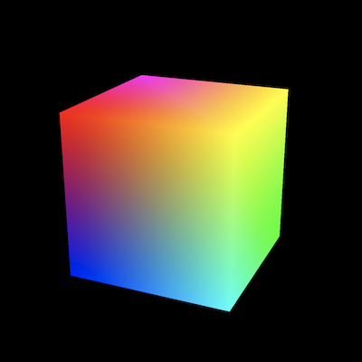

之前的章节我们基本都在画三角形，这主要也是因为三角形是最基础的平面图形。其它所有的图形，不管是平面的还是立体的，简单的还是复杂的，都可以通过拼接三角形来完成。比如矩形可以由3个三角形组成，立方体可以由12个三角形组成（每个面2个三角形），而圆形可以通过拼接尽量多的三角形来逼近。这一章我们就试着来绘制一个旋转的立方体来进入三维世界。

## 按索引绘制顶点

绘制立方体和绘制一个三角形本质上没有区别，只是数量上从一次绘制1个三角形变成一次绘制12个三角形。我们可以照搬之前的代码，只需要将顶点数据从3个增加到36个即可。不过如果我们仔细看看这36个顶点就会发现其中有大量重复的顶点，对于一个立方体而言，实际上8个顶点就足够定义了。如果我们可以使用8个而非36个顶点来绘制立方体，那么必定可以大大地减少图像绘制所需的输入数据，但同时这也意味着其中的顶点需要被重复使用。之前我们是严格按照每3个顶点绘制一个三角形的方式进行绘图，这种方式没法重复使用顶点数据。为了让8个顶点也能绘制出12个三角形，我们需要在顶点数据之上引入一个的顶点索引。索引的每一个元素存储一个顶点在顶点数据中的序号，然后我们就可以通过构建一个包含32个元素的顶点索引来间接定义32个顶点。虽然引入顶点索引需要额外的存储空间，但一个序号的大小比一个顶点数据要小很多，从最终的结果来看，我们依旧会相较存储36个顶点的方案节约大量的存储空间。

```typescript
const vertices = new Float32Array([
  // 每个顶点数据包含坐标信息与颜色信息
  // x, y, z, r, g, b, a
  -1, 1, 1, 1, 0, 0, 1,
  1, 1, 1, 1, 1, 0, 1,
  1, -1, 1, 0, 1, 1, 1,
  -1, -1, 1, 0, 0, 1, 1,
  -1, 1, -1, 1, 0, 1, 1,
  1, 1, -1, 1, 1, 0, 1,
  1, -1, -1, 0, 1, 0, 1,
  -1, -1, -1, 0, 0, 0, 1,
]);

const vertexIndex = new Uint16Array([
  // 正面
  0, 1, 2,
  2, 3, 0,

  // 背面
  4, 5, 6,
  6, 7, 4,

  // 左面
  4, 0, 3,
  3, 7, 4,

  // 右面
  1, 5, 6,
  6, 2, 1,

  // 上面
  4, 5, 1,
  1, 0, 4,

  // 下面
  7, 6, 2,
  2, 3, 7,
]);
```

除了我们已经习惯的 `vertices` 顶点数据，这里我们新定义了一个顶点索引 `vertexIndex`。它包含36个顶点索引，其中每三个构成一个三角形，然后每六个组成一个面。另外索引本身只可能是从0开始的整数，相应的数据类型也就可以改用较小的 `Uint16`。至于为啥我们这里不使用更小的 `Uint8`，那是由于 WebGPU 支持的最小[索引数据类型](https://www.w3.org/TR/webgpu/#enumdef-gpuindexformat)就是 `Uint16`。

同顶点数据一样，我们需要将索引数据通过 `GPUBuffer` 传入 GPU，然后调用新的 `drawIndexed` 方法来按照顶点索引而非顶点数据来绘制图形：
```typescript
const vertexIndexBuffer = device.createBuffer({
  size: vertexIndex.byteLength,
  uasge: GPUBufferUsage.INDEX | GPUBufferUsage.CPPY_DST,
  mappedAtCreation: true,
});
new Uint16Array(vertexIndexBuffer.getMappedRange()).set(vertexIndex);
vertexIndexBuffer.unmap();

...
passEncoder.setIndexBuffer(vertexIndexBuffer, "uint16");
passEncoder.drawIndexed(vertexIndex.length);
...
```
最后我们会得到这样的渲染结果：



说好的立方体呢？

## 视角与投影矩阵



## 深度检测


